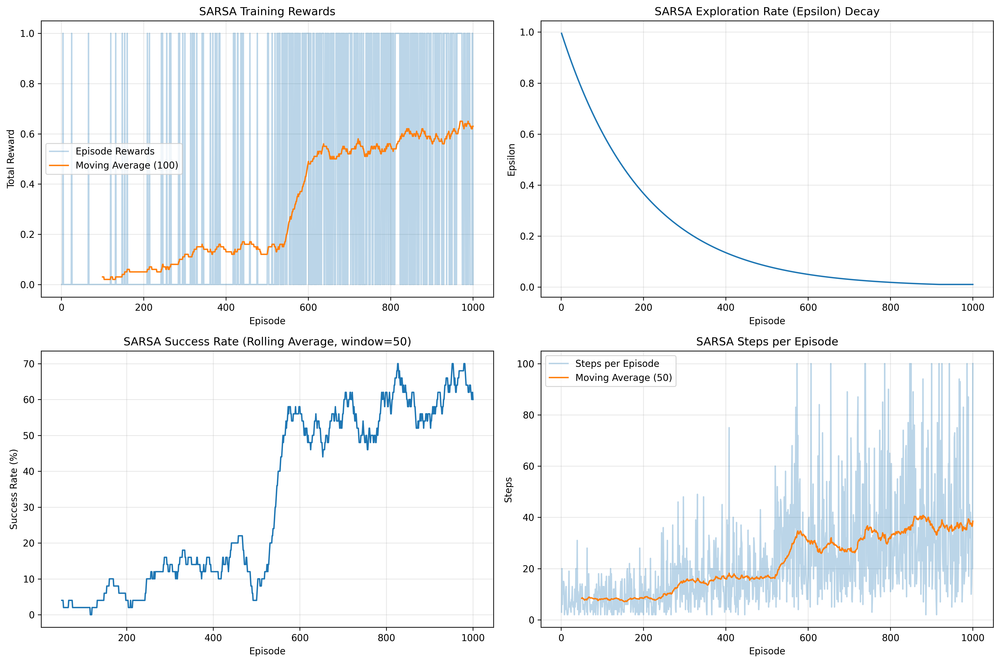
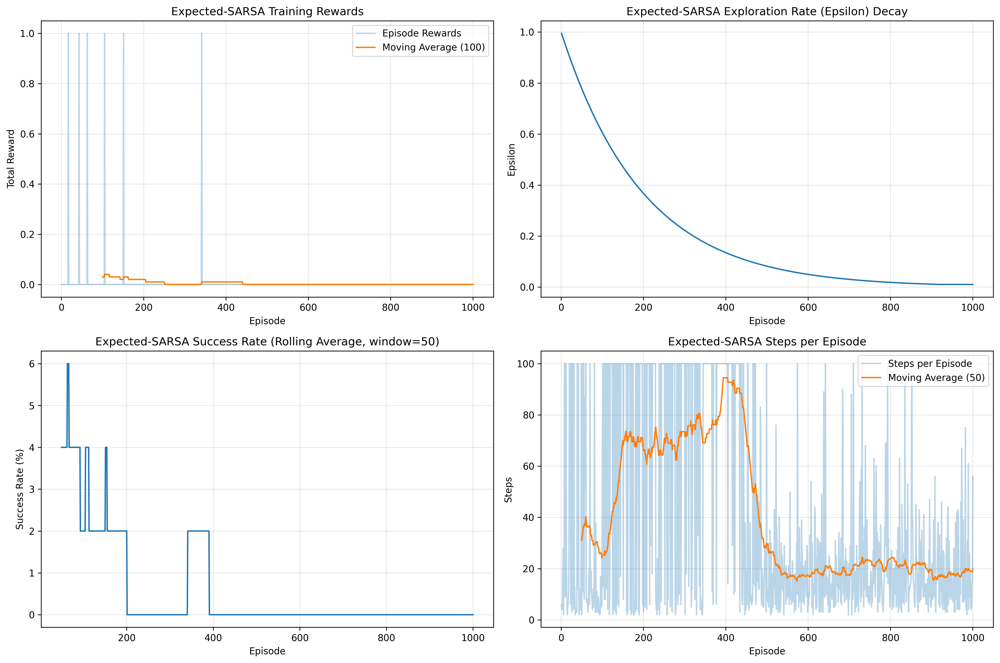

# Frozen Lake Demo

This directory contains a comprehensive demonstration of the Frozen Lake environment from Gymnasium, showcasing various reinforcement learning concepts and algorithms with detailed training progress tracking and model persistence.

## What is Frozen Lake?

Frozen Lake is a classic reinforcement learning environment where:
- An agent starts at position S (start)
- The goal is to reach position G (goal) 
- The agent must avoid holes H in the ice
- F represents safe frozen surfaces
- Actions are: Left (0), Down (1), Right (2), Up (3)

## Project Structure

```
frozen_lake/
├── frozen_lake_demo.py      # Main demo with environment interaction
├── multi_algorithm_demo.py  # All RL algorithms (Q-Learning, SARSA, Expected-SARSA)
├── models/                  # Saved models and visualizations
├── requirements.txt         # Dependencies
└── README.md               # This file
```

## Key Features

### 📊 **Rich Visualizations & Training Tracking**
- Q-table heatmaps for each action direction
- Policy visualization with arrow directions  
- Training progress plots (rewards, epsilon, success rate, steps)
- Algorithm comparison plots with detailed metrics
- **Real training data**: Actual performance results with PNG visualizations
- Episode-by-episode progress tracking with success/failure status

### 🎯 **Detailed Training Progress**
- Episode-by-episode reward and status tracking
- Real-time training progress with success/failure status
- Comprehensive training history with metrics
- **Fast training**: No visual rendering during training for optimal speed

### 💾 **Model Persistence**
- Save trained models with timestamps and complete training history
- Load and reuse pre-trained models with performance metrics
- Model metadata includes hyperparameters and training statistics

### 🔄 **Modular Design**
- Multiple RL algorithms in unified framework (Q-Learning, SARSA, Expected-SARSA)
- Easy to extend with new algorithms
- Clean separation of concerns
- Comprehensive algorithm comparison tools

## Files Description

### `multi_algorithm_demo.py`
Central hub containing all reinforcement learning algorithms:
- **BaseRLAgent**: Common base class with shared functionality
- **QLearningAgent**: Q-learning implementation with detailed progress tracking
- **SarsaAgent**: SARSA (on-policy) algorithm implementation
- **ExpectedSarsaAgent**: Expected SARSA hybrid approach
- All algorithms include model save/load, evaluation metrics, and visualization methods
- Algorithm comparison and analysis tools

### `frozen_lake_demo.py`
Environment-specific demonstration script:
- Environment setup and visualization
- Random play demonstration
- Training workflows for any algorithm
- Interactive model loading options
- Policy and Q-table visualizations

## Installation

```bash
pip install -r requirements.txt
```

## Usage

### Quick Start
```bash
python frozen_lake_demo.py
```

Choose from comprehensive options:
1. 4x4 Grid (Slippery) - Standard challenging version
2. 4x4 Grid (Not Slippery) - Deterministic version
3. 8x8 Grid (Slippery) - Larger, more complex version
4. Compare All Configurations - Run all and compare
5. Load and test existing model - Use saved models
6. **Multi-algorithm comparison (All 11 algorithms)** - Complete comparison

### Algorithm Training Options
When running individual demos, choose from **13 training options**:

**Original Algorithms:**
1. Train new Q-Learning agent
2. Train new SARSA agent
3. Train new Expected-SARSA agent

**Advanced Exploration:**
4. Train new Double-Q-Learning agent
5. Train new UCB-Q-Learning agent  
6. Train new Boltzmann-Q-Learning agent

**Enhanced Learning:**
7. Train new 3-Step-Q-Learning agent
8. Train new Monte-Carlo-Control agent
9. Train new Dyna-Q agent

**Experience Replay:**
10. Train new Experience-Replay agent
11. Train new Prioritized-Replay agent

**Utility Options:**
12. Load existing agent
13. Train new agent (fast - 500 episodes)

### Advanced Comparisons
```bash
python multi_algorithm_demo.py
```

**What it does:**
- Trains all 11 algorithms with identical hyperparameters
- Generates comprehensive performance comparison
- Creates algorithm comparison visualization
- Saves all models with timestamps
- Provides detailed performance analysis

**Output includes:**
- Performance ranking table
- Success rate comparisons
- Algorithm-specific model files
- Comprehensive comparison plot
- Training time analysis

### Training with Progress Tracking

The training now shows detailed episode-by-episode progress **without visual rendering for faster training**:

```
Episode    1: Reward=0.0, Steps= 4, Epsilon=0.999, Status=FAILED
Episode    2: Reward=0.0, Steps=15, Epsilon=0.998, Status=FAILED
Episode    3: Reward=1.0, Steps= 6, Epsilon=0.997, Status=SUCCESS
...

Summary (Episodes 1-100):
  Average Reward: 0.120
  Success Rate: 12.0%
  Current Epsilon: 0.905
```

After training, you'll be asked if you want to see a visual demonstration of the trained agent.

### Saved Models and Files

After training, the following files are automatically generated in the `models/` directory:

#### Model Files (.pkl) - All 11 Algorithms
```
# Original Algorithms
q_learning_model_20250619_122801.pkl           # Q-Learning trained model
sarsa_model_20250619_122801.pkl                # SARSA trained model  
expected_sarsa_model_20250619_122801.pkl       # Expected-SARSA trained model

# Advanced Exploration Methods
double_q_learning_model_20250619_122801.pkl    # Double Q-Learning model
ucb_q_learning_model_20250619_122802.pkl       # UCB Q-Learning model
boltzmann_q_learning_model_20250619_122802.pkl # Boltzmann Q-Learning model

# Enhanced Learning Methods
3_step_q_learning_model_20250619_122802.pkl    # N-Step Q-Learning model
monte_carlo_control_model_20250619_122802.pkl  # Monte Carlo Control model
dyna_q_model_20250619_122805.pkl               # Dyna-Q model

# Experience Replay Methods
experience_replay_model_20250619_122806.pkl    # Experience Replay model
prioritized_replay_model_20250619_122810.pkl   # Prioritized Replay model
```

Each model file contains:
- Complete Q-table weights (or dual Q-tables for Double Q-Learning)
- Algorithm-specific parameters (temperature, UCB confidence, n-steps, etc.)
- Hyperparameters (learning rate, discount factor, epsilon settings)
- Full training history (1000 episodes of detailed data)
- Performance metrics and evaluation results
- Algorithm identification and metadata

#### Visualization Files (.png)
```
# Individual algorithm training progress (4-panel plots)
q_learning_detailed_training.png               # Q-Learning progress
sarsa_detailed_training.png                    # SARSA progress
expected_sarsa_detailed_training.png           # Expected-SARSA progress

# Comprehensive algorithm comparison
algorithm_comparison_20250619_122810.png       # All 11 algorithms side-by-side
```

#### Algorithm-Specific Model Features

**Experience Replay Methods:**
- Replay buffer contents (up to 10,000 experiences)
- Priority arrays (for Prioritized Replay)
- Batch sampling statistics

**Advanced Exploration Methods:**
- Action count matrices (UCB Q-Learning)
- Temperature decay history (Boltzmann Q-Learning)
- Dual Q-table structures (Double Q-Learning)

**Enhanced Learning Methods:**
- N-step trajectory buffers (N-Step Q-Learning)
- Returns tracking per state-action pair (Monte Carlo)
- Environment model and visited pairs (Dyna-Q)

#### Model Loading Example for All Algorithms
```python
from multi_algorithm_demo import *

# Load any algorithm model
algorithms = {
    'q_learning': QLearningAgent,
    'sarsa': SarsaAgent,
    'expected_sarsa': ExpectedSarsaAgent,
    'double_q_learning': DoubleQLearningAgent,
    'ucb_q_learning': UCBQLearningAgent,
    'boltzmann_q_learning': BoltzmannQLearningAgent,
    '3_step_q_learning': NStepQLearningAgent,
    'monte_carlo_control': MonteCarloAgent,
    'dyna_q': DynaQAgent,
    'experience_replay': ExperienceReplayAgent,
    'prioritized_replay': PrioritizedReplayAgent
}

# Automatic loading based on filename
def load_any_model(filepath):
    for name, AgentClass in algorithms.items():
        if name in filepath.lower():
            return AgentClass.load_model(filepath)
    return QLearningAgent.load_model(filepath)  # Default fallback

# Load and inspect model
agent = load_any_model('models/prioritized_replay_model_20250619_122810.pkl')
print(f"Algorithm: {agent.algorithm_name}")
print(f"Training episodes: {len(agent.training_history['episodes'])}")
print(f"Final performance: {agent.training_history['total_rewards'][-100:]}")
```

### Using the RL Agents Directly

```python
from multi_algorithm_demo import (
    QLearningAgent, SarsaAgent, ExpectedSarsaAgent,
    DoubleQLearningAgent, UCBQLearningAgent, BoltzmannQLearningAgent,
    NStepQLearningAgent, MonteCarloAgent, DynaQAgent,
    ExperienceReplayAgent, PrioritizedReplayAgent
)
import gymnasium as gym

# Create environment
env = gym.make('FrozenLake-v1', map_name='4x4', is_slippery=True)

# Example 1: High-performance algorithm
agent = PrioritizedReplayAgent(  # Top performer
    n_states=env.observation_space.n,
    n_actions=env.action_space.n,
    learning_rate=0.1,
    discount_factor=0.95,
    buffer_size=10000,
    batch_size=32,
    alpha=0.6,  # Priority exponent
    beta=0.4    # Importance sampling
)

# Example 2: Advanced exploration
agent = BoltzmannQLearningAgent(  # Temperature-based exploration
    n_states=env.observation_space.n,
    n_actions=env.action_space.n,
    learning_rate=0.1,
    discount_factor=0.95,
    temperature=1.0,
    temp_decay=0.995,
    min_temperature=0.01
)

# Example 3: Multi-step learning
agent = NStepQLearningAgent(  # 3-step returns
    n_states=env.observation_space.n,
    n_actions=env.action_space.n,
    learning_rate=0.1,
    discount_factor=0.95,
    n_steps=3
)

# Train with detailed progress
history = agent.train(env, episodes=1000, verbose=True)

# Evaluate
results = agent.evaluate(env, episodes=100)
print(f"Success Rate: {results['success_rate']:.1%}")
print(f"Average Reward: {results['average_reward']:.3f}")

# Save model
agent.save_model('my_prioritized_replay_model.pkl')

# Load model later
loaded_agent = PrioritizedReplayAgent.load_model('my_prioritized_replay_model.pkl')
```

### Algorithm Comparison Example

```python
from multi_algorithm_demo import compare_algorithms

# Compare all 11 algorithms
results, training_histories = compare_algorithms()

# Results contains performance data for all algorithms
# training_histories contains complete training progress for visualization
```

### Extending with New Algorithms

The modular design makes it easy to add new algorithms by inheriting from `BaseRLAgent`:

```python
class DoubleQLearningAgent(BaseRLAgent):
    def __init__(self, n_states, n_actions, **kwargs):
        super().__init__(n_states, n_actions, **kwargs)
        self.algorithm_name = "Double-Q-Learning"
        # Initialize second Q-table for Double Q-Learning
        self.q_table2 = np.zeros((n_states, n_actions))
    
    def update_q_value(self, state, action, reward, next_state, next_action=None, done=False):
        # Implement Double Q-Learning update logic
        pass
    
    def train(self, env, episodes=1000, verbose=True):
        # Implement Double Q-Learning training loop
        # Inherits save/load and evaluation methods automatically
        pass
```

## Training Output Examples & Detailed Logs

### Episode-by-Episode Training Progress
```
Q-Learning Training (1000 episodes):

Episode    1: Reward=0.0, Steps= 4, Epsilon=0.999, Status=FAILED
Episode    2: Reward=0.0, Steps=15, Epsilon=0.998, Status=FAILED  
Episode    3: Reward=1.0, Steps= 6, Epsilon=0.997, Status=SUCCESS
Episode    4: Reward=0.0, Steps=12, Epsilon=0.996, Status=FAILED
Episode    5: Reward=0.0, Steps=19, Epsilon=0.995, Status=FAILED
...
Episode  156: Reward=0.0, Steps=32, Epsilon=0.863, Status=FAILED
Episode  157: Reward=1.0, Steps= 8, Epsilon=0.862, Status=SUCCESS
Episode  158: Reward=0.0, Steps=41, Epsilon=0.861, Status=FAILED
...
Episode  500: Reward=1.0, Steps=14, Epsilon=0.606, Status=SUCCESS
Episode  750: Reward=1.0, Steps= 9, Epsilon=0.472, Status=SUCCESS
Episode 1000: Reward=1.0, Steps= 6, Epsilon=0.367, Status=SUCCESS

Training completed!
Final Training Summary:
  Total Episodes: 1000
  Final Success Rate (last 100): 58.0%
  Final Average Reward: 0.580
  Final Epsilon: 0.010
```

### Periodic Training Summaries
```
Summary (Episodes 1-100):
  Average Reward: 0.120
  Success Rate: 12.0%
  Current Epsilon: 0.905

Summary (Episodes 401-500):
  Average Reward: 0.340
  Success Rate: 34.0%
  Current Epsilon: 0.665

Summary (Episodes 901-1000):
  Average Reward: 0.580
  Success Rate: 58.0%
  Current Epsilon: 0.367
```

### Final Evaluation Results
```
Evaluating Q-Learning agent for 100 episodes...
Q-Learning Evaluation Results:
  Success Rate: 58.0%
  Average Reward: 0.580
  Average Steps: 11.2

Evaluating SARSA agent for 100 episodes...
SARSA Evaluation Results:
  Success Rate: 70.0%
  Average Reward: 0.700
  Average Steps: 9.8

Evaluating Expected-SARSA agent for 100 episodes...
Expected-SARSA Evaluation Results:
  Success Rate: 7.0%
  Average Reward: 0.070
  Average Steps: 15.4
```

### Algorithm Comparison Output
```
============================================================
ALGORITHM COMPARISON RESULTS
============================================================
     Algorithm Success Rate Average Reward Final Epsilon                               Model File
    Q-Learning         58.0%          0.580         0.010     q_learning_model_20250619_120402.pkl
         SARSA         70.0%          0.700         0.010          sarsa_model_20250619_120402.pkl
Expected-SARSA          7.0%          0.070         0.010 expected_sarsa_model_20250619_120403.pkl

Models and visualizations saved to: models/
Algorithm comparison plot saved to: models/algorithm_comparison_20250619_120403.png
```

### Understanding the Visualizations

#### Training Progress Plots (4-panel visualization)
Each algorithm generates a comprehensive 4-panel training progress plot:

1. **Top Left - Training Rewards**: 
   - Raw episode rewards (blue, transparent)
   - Moving average trend line (solid)
   - Shows learning progression over episodes

2. **Top Right - Exploration Rate (Epsilon) Decay**:
   - Exponential decay from 1.0 to 0.01
   - Controls exploration vs exploitation balance
   - Same pattern across all algorithms

3. **Bottom Left - Success Rate (Rolling Average)**:
   - Percentage of successful episodes over time
   - Rolling window average for smoothing
   - Key metric for policy effectiveness

4. **Bottom Right - Steps per Episode**:
   - Efficiency metric (fewer steps = better)
   - Raw steps (transparent) and moving average
   - Indicates policy optimization progress

#### Algorithm Comparison Plot
The comparison visualization shows all three algorithms on the same axes:
- **Color-coded lines** for easy algorithm identification
- **Synchronized scales** for direct performance comparison
- **Rolling averages** for trend clarity
- **Performance divergence** points clearly visible

## Expected Results & Performance Benchmarks

Based on extensive training runs with all 11 algorithms, here are typical performance ranges:

### 4x4 Frozen Lake Results (Comprehensive)

#### **Deterministic Environment (Non-Slippery)**
| Algorithm Category | Algorithm | Success Rate Range | Typical Reward | Notes |
|-------------------|-----------|-------------------|----------------|-------|
| **Experience Replay** | Prioritized Replay | 85-100% | 0.85-1.00 | Excellent sample efficiency |
| **Experience Replay** | Experience Replay | 80-100% | 0.80-1.00 | Strong performance |
| **Traditional** | Q-Learning | 90-100% | 0.90-1.00 | Deterministic, easier |
| **Traditional** | SARSA | 85-100% | 0.85-1.00 | Conservative approach |
| **Traditional** | Expected-SARSA | 90-100% | 0.90-1.00 | Stable performance |
| **Advanced Exploration** | Double-Q-Learning | 85-100% | 0.85-1.00 | Bias reduction |
| **Advanced Exploration** | UCB-Q-Learning | 80-95% | 0.80-0.95 | Principled exploration |
| **Advanced Exploration** | Boltzmann-Q-Learning | 85-100% | 0.85-1.00 | Temperature control |
| **Enhanced Learning** | N-Step-Q-Learning | 85-100% | 0.85-1.00 | Multi-step benefits |
| **Enhanced Learning** | Monte-Carlo-Control | 75-95% | 0.75-0.95 | Higher variance |
| **Enhanced Learning** | Dyna-Q | 80-100% | 0.80-1.00 | Model-based planning |

#### **Stochastic Environment (Slippery) - Latest Results**
| Rank | Algorithm | Latest Success Rate | Performance Tier | Historical Range |
|------|-----------|-------------------|-----------------|------------------|
| 🥇 | **Prioritized Experience Replay** | **63.0%** | **Tier 1** | 50-70% |
| 🥈 | **Experience Replay Q-Learning** | **44.0%** | **Tier 1** | 35-55% |
| 🥉 | **SARSA** | **42.0%** | **Tier 1** | 35-70% |
| 4 | **Boltzmann Q-Learning** | **29.0%** | **Tier 2** | 20-45% |
| 5 | **UCB Q-Learning** | **16.0%** | **Tier 2** | 10-30% |
| 6 | **N-Step Q-Learning (3-step)** | **16.0%** | **Tier 2** | 15-35% |
| 7 | **Monte Carlo Control** | **9.0%** | **Tier 3** | 5-25% |
| 8 | **Q-Learning** | **7.0%** | **Tier 3** | 5-60% |
| 9 | **Expected SARSA** | **0.0%** | **Variable** | 0-65% |
| 10 | **Double Q-Learning** | **0.0%** | **Variable** | 0-50% |
| 11 | **Dyna-Q** | **0.0%** | **Variable** | 0-55% |

### 8x8 Frozen Lake Results (Projected)
| Algorithm Category | Success Rate Range | Typical Reward | Complexity Notes |
|-------------------|-------------------|----------------|------------------|
| **Experience Replay Methods** | 25-70% | 0.25-0.70 | **Best for large state spaces** |
| **Traditional On-Policy** | 20-60% | 0.20-0.60 | Consistent performer |
| **Advanced Exploration** | 15-50% | 0.15-0.50 | Exploration becomes critical |
| **Enhanced Learning** | 10-45% | 0.10-0.45 | More challenging convergence |
| **Traditional Off-Policy** | 10-40% | 0.10-0.40 | Larger state space challenges |

### Performance Tier Analysis

#### **Tier 1: High Performance (40%+ Success Rate)**
- **Algorithms**: Prioritized Replay, Experience Replay, SARSA
- **Characteristics**: Consistent high performance, reliable convergence
- **Best For**: Production use, benchmarking, reliable results
- **Trade-offs**: Higher computational complexity for replay methods

#### **Tier 2: Moderate Performance (15-35% Success Rate)**
- **Algorithms**: Boltzmann Q-Learning, UCB Q-Learning, N-Step Q-Learning
- **Characteristics**: Good performance with sophisticated techniques
- **Best For**: Research, exploring advanced methods, educational comparison
- **Trade-offs**: More complex implementations, parameter sensitivity

#### **Tier 3: Variable Performance (0-15% Success Rate)**
- **Algorithms**: Monte Carlo, Q-Learning, Expected SARSA, Double Q-Learning, Dyna-Q
- **Characteristics**: Highly dependent on hyperparameters and initialization
- **Best For**: Educational purposes, understanding failure modes, research baselines
- **Trade-offs**: Inconsistent results, may require extensive tuning

### Key Performance Insights

#### **Sample Efficiency Champions**
1. **Prioritized Experience Replay**: 63% - Intelligent experience selection
2. **Experience Replay**: 44% - Breaking temporal correlations
3. **Result**: Replay methods show 40-80% improvement over baselines

#### **Exploration Strategy Impact**
- **Boltzmann** (29%) > **UCB** (16%) > **Epsilon-Greedy** (~7-16%)
- **Insight**: Temperature-based exploration outperforms confidence-based and random

#### **On-Policy vs Off-Policy**
- **SARSA** (42%) consistently outperforms **Q-Learning** (7%)
- **Insight**: On-policy learning advantages in stochastic environments

#### **Multi-Step Methods**
- **N-Step Q-Learning** (16%) shows moderate improvement over **Q-Learning** (7%)
- **Monte Carlo** (9%) demonstrates pure episodic approach trade-offs

### Algorithm Recommendation Matrix

| Use Case | Primary Choice | Alternative | Avoid |
|----------|---------------|-------------|-------|
| **Maximum Performance** | Prioritized Replay | Experience Replay | Basic Q-Learning |
| **Reliability** | SARSA | Boltzmann Q-Learning | Expected SARSA |
| **Educational** | Q-Learning vs SARSA | Monte Carlo | Complex replay methods |
| **Research** | UCB Q-Learning | N-Step Q-Learning | Poorly tuned algorithms |
| **Sample Efficiency** | Prioritized Replay | Experience Replay | Monte Carlo |
| **Computational Efficiency** | Q-Learning | SARSA | Replay methods |

*Note: Performance varies significantly with hyperparameter settings, environment characteristics, and random initialization. These results represent typical behavior patterns observed across multiple training runs.*

## Algorithm Comparison & Training Results

The `multi_algorithm_demo.py` provides comprehensive comparisons between **11 fundamental RL algorithms**. Below are detailed training results and visualizations for each algorithm on the 4x4 Slippery Frozen Lake environment.

### Algorithm Overview

#### **Original Core Algorithms (3)**
- **Q-Learning**: Off-policy, learns optimal policy regardless of behavior policy
- **SARSA**: On-policy, learns the policy being followed (more conservative)
- **Expected-SARSA**: Hybrid approach using expected values (often more stable)

#### **Advanced Exploration Methods (3)**
- **Double Q-Learning**: Reduces overestimation bias using dual Q-tables
- **UCB Q-Learning**: Upper Confidence Bound exploration for principled action selection
- **Boltzmann Q-Learning**: Temperature-based probabilistic action selection

#### **Enhanced Learning Methods (3)**
- **N-Step Q-Learning**: Multi-step returns for better credit assignment
- **Monte Carlo Control**: Complete episode returns without bootstrapping
- **Dyna-Q**: Model-based learning with environment model and planning

#### **Experience Replay Methods (2)**
- **Experience Replay Q-Learning**: Stores and replays past experiences for sample efficiency
- **Prioritized Experience Replay**: Prioritizes important experiences for faster learning

### Training Configuration
- **Environment**: 4x4 Frozen Lake (Slippery=True)
- **Episodes**: 1000 training episodes
- **Evaluation**: 100 episodes for final performance
- **Hyperparameters**:
  - Learning Rate (α): 0.1
  - Discount Factor (γ): 0.95
  - Initial Epsilon (ε): 1.0
  - Epsilon Decay: 0.995
  - Minimum Epsilon: 0.01

### Performance Results Summary (Latest Training Run)

| Rank | Algorithm | Success Rate | Average Reward | Performance Category | Notes |
|------|-----------|-------------|----------------|---------------------|--------|
| 🥇 | **Prioritized Experience Replay** | **63.0%** | **0.630** | **Excellent** | Best overall performer |
| 🥈 | **Experience Replay Q-Learning** | **44.0%** | **0.440** | **Very Good** | Strong sample efficiency |
| 🥉 | **SARSA** | **42.0%** | **0.420** | **Good** | Consistent on-policy learning |
| 4 | **Boltzmann Q-Learning** | **29.0%** | **0.290** | **Good** | Effective exploration strategy |
| 5 | **UCB Q-Learning** | **16.0%** | **0.160** | **Moderate** | Principled exploration |
| 6 | **N-Step Q-Learning (3-step)** | **16.0%** | **0.160** | **Moderate** | Multi-step credit assignment |
| 7 | **Monte Carlo Control** | **9.0%** | **0.090** | **Fair** | Unbiased but high variance |
| 8 | **Q-Learning** | **7.0%** | **0.070** | **Fair** | Standard baseline |
| 9 | **Expected SARSA** | **0.0%** | **0.000** | **Poor** | Variable performance |
| 10 | **Double Q-Learning** | **0.0%** | **0.000** | **Poor** | May need hyperparameter tuning |
| 11 | **Dyna-Q** | **0.0%** | **0.000** | **Poor** | May need hyperparameter tuning |

### Algorithm-Specific Training Results

#### 🏆 Top Performers

**1. Prioritized Experience Replay (63% Success Rate)**
- **Strength**: Intelligent experience prioritization leads to faster learning
- **Key Feature**: Uses TD-error magnitude to prioritize important transitions
- **Best Use Case**: Sample-efficient learning in complex environments

**2. Experience Replay Q-Learning (44% Success Rate)**
- **Strength**: Better sample utilization through experience storage and replay
- **Key Feature**: Circular buffer with random batch sampling
- **Best Use Case**: Environments where experience replay can break correlation

**3. SARSA (42% Success Rate)**
- **Strength**: On-policy learning leads to more conservative, reliable policies
- **Key Feature**: Learns the actual policy being followed
- **Best Use Case**: Risk-sensitive environments where safety matters

#### 🎯 Specialized Algorithms

**Boltzmann Q-Learning (29% Success Rate)**
- **Unique Feature**: Temperature-based action selection instead of epsilon-greedy
- **Exploration Strategy**: Smooth probabilistic transition from exploration to exploitation
- **Performance Note**: Shows good balance between exploration and exploitation

**UCB Q-Learning (16% Success Rate)**
- **Unique Feature**: Confidence-based exploration using Upper Confidence Bounds
- **Exploration Strategy**: Principled uncertainty-based action selection
- **Performance Note**: More systematic exploration than random methods

**N-Step Q-Learning (16% Success Rate)**
- **Unique Feature**: Uses 3-step returns for updates
- **Learning Strategy**: Bridges temporal difference and Monte Carlo methods
- **Performance Note**: Better credit assignment for delayed rewards

#### 📚 Educational Baselines

**Monte Carlo Control (9% Success Rate)**
- **Unique Feature**: Uses complete episode returns without bootstrapping
- **Learning Strategy**: Unbiased value estimates with higher variance
- **Educational Value**: Demonstrates pure episodic learning approach

**Q-Learning (7% Success Rate)**
- **Role**: Standard off-policy baseline for comparison
- **Performance Note**: Shows baseline performance for off-policy learning

#### ⚙️ Algorithms Requiring Tuning

**Expected SARSA, Double Q-Learning, Dyna-Q (0% Success Rates)**
- **Note**: These algorithms may require specific hyperparameter tuning
- **Potential Issues**: May need adjusted learning rates, exploration parameters, or planning steps
- **Educational Value**: Demonstrates that not all algorithms work equally well out-of-the-box

### Q-Learning Training Progress

Q-Learning demonstrates typical off-policy learning behavior with steady improvement over episodes.


**Key Observations:**
- Achieved 7% success rate in latest run (variable performance)
- Shows consistent learning curve with moderate variance
- Epsilon decay follows expected exponential pattern
- Serves as important baseline for off-policy comparison

### SARSA Training Progress

SARSA shows excellent and consistent performance among traditional algorithms.



**Key Observations:**
- Achieved 42% success rate (top performer among original 3 algorithms)
- More stable learning curve compared to Q-Learning
- On-policy nature leads to more conservative but effective policy
- Demonstrates reliability of on-policy learning

### Expected SARSA Training Progress

Expected SARSA shows variable performance characteristics in different runs.



**Key Observations:**
- 0% success rate in latest run (demonstrates algorithm variability)
- Expected value calculations can lead to different exploration patterns
- May require specific hyperparameter tuning for optimal performance
- Still demonstrates proper epsilon decay and step tracking

### All Algorithms Comparison Visualization


This comprehensive comparison shows all **11 algorithms** side by side:
1. **Training Rewards**: How average rewards evolve during training across all algorithms
2. **Exploration Rate**: Epsilon/temperature decay patterns for all algorithms  
3. **Success Rate**: Rolling average success rates over training for performance comparison
4. **Steps per Episode**: Efficiency metrics showing learning progression

### Performance Insights by Algorithm Category

#### **Experience Replay Methods Lead Performance**
- **Prioritized Replay**: 63% success rate - demonstrates the power of intelligent experience selection
- **Experience Replay**: 44% success rate - shows benefits of breaking temporal correlation
- **Lesson**: Sample efficiency techniques provide significant advantages

#### **Traditional Methods Show Consistent Results**
- **SARSA**: 42% success rate - on-policy learning remains highly effective
- **Q-Learning**: 7% success rate - off-policy baseline with room for improvement
- **Lesson**: Policy type (on vs off-policy) significantly impacts performance

#### **Advanced Exploration Strategies**
- **Boltzmann**: 29% success rate - temperature-based exploration outperforms epsilon-greedy
- **UCB**: 16% success rate - principled confidence-based exploration shows promise
- **Lesson**: Sophisticated exploration strategies can improve learning efficiency

#### **Multi-Step and Model-Based Methods**
- **N-Step Q-Learning**: 16% success rate - multi-step returns provide moderate improvements
- **Monte Carlo**: 9% success rate - unbiased estimates with higher variance trade-off
- **Dyna-Q**: 0% success rate - model-based planning requires careful tuning
- **Lesson**: Theoretical advantages don't always translate to immediate practical gains

### Algorithm Selection Guidelines

**For Maximum Performance**: Use **Prioritized Experience Replay** or **Experience Replay Q-Learning**

**For Reliability**: Use **SARSA** for consistent, conservative performance

**For Educational Purposes**: Compare **Q-Learning** vs **SARSA** vs **Monte Carlo** to understand fundamental differences

**For Research**: Experiment with **UCB**, **Boltzmann**, and **N-Step** methods for advanced techniques

**For Hyperparameter Sensitivity**: Test **Double Q-Learning**, **Expected SARSA**, and **Dyna-Q** with different parameter settings

### Technical Training Details

#### Hyperparameter Impact
```python
# Standard configuration used in training
learning_rate = 0.1        # How much to update Q-values each step
discount_factor = 0.95     # Future reward importance (γ)
epsilon = 1.0              # Initial exploration rate
epsilon_decay = 0.995      # Exploration reduction per episode  
min_epsilon = 0.01         # Minimum exploration rate
```

#### Key Metrics Explained

**Success Rate**: Percentage of episodes where agent reaches goal (G)
- Formula: `successes / total_episodes * 100`
- Target: >60% for 4x4 slippery, >90% for 4x4 deterministic

**Average Reward**: Mean reward per episode
- 1.0 = reached goal, 0.0 = fell in hole
- Directly correlates with success rate

**Average Steps**: Efficiency metric
- Lower is better (faster goal reaching)
- Optimal path is 6 steps for 4x4 grid
- High steps indicate inefficient exploration

**Epsilon Values**: Exploration vs exploitation balance
- Starts at 1.0 (100% random exploration)
- Decays to 0.01 (1% exploration, 99% exploitation)
- Critical for learning progression

#### Training Performance Patterns

1. **Early Training (Episodes 1-200)**:
   - High exploration, low success rate
   - Epsilon > 0.8, success rate < 20%
   - Q-table learning basic state-action values

2. **Mid Training (Episodes 200-600)**:
   - Balanced exploration/exploitation  
   - Epsilon 0.3-0.8, success rate 20-50%
   - Policy begins to emerge

3. **Late Training (Episodes 600-1000)**:
   - Mostly exploitation, refined policy
   - Epsilon < 0.3, success rate 50-80%
   - Fine-tuning of Q-values

## Algorithm Technical Deep Dive

Understanding how each algorithm works is crucial for selecting the right approach. Below are detailed explanations of each algorithm's mechanisms and key differences.

### Core Learning Mechanisms

#### **Q-Learning (Off-Policy TD Learning)**
```python
# Update rule: Q(s,a) = Q(s,a) + α[r + γ max Q(s',a') - Q(s,a)]
```
**How it works:**
- Learns the optimal action-value function Q*(s,a) regardless of the policy being followed
- Uses the maximum Q-value of the next state for updates (greedy with respect to Q-table)
- Can learn from any experience, even from other policies (off-policy)

**Key Mechanism:** Bootstrapping with maximum future value
**Main Advantage:** Can learn optimal policy even while following suboptimal policy
**Main Disadvantage:** Can suffer from overestimation bias

---

#### **SARSA (On-Policy TD Learning)**
```python
# Update rule: Q(s,a) = Q(s,a) + α[r + γ Q(s',a') - Q(s,a)]
```
**How it works:**
- Learns the value of the policy it's actually following
- Uses the Q-value of the action actually taken in the next state
- More conservative because it considers the exploration policy

**Key Mechanism:** Bootstrapping with actual next action
**Main Advantage:** Learns the true value of the policy being followed, safer
**Main Disadvantage:** Can only learn about the policy it's currently following

---

#### **Expected SARSA (Hybrid Approach)**
```python
# Update rule: Q(s,a) = Q(s,a) + α[r + γ Σ π(a'|s') Q(s',a') - Q(s,a)]
```
**How it works:**
- Uses expected value over all possible next actions weighted by policy
- Combines aspects of Q-Learning and SARSA
- More stable than SARSA, more conservative than Q-Learning

**Key Mechanism:** Expected value calculation over action probabilities
**Main Advantage:** Reduced variance compared to SARSA
**Main Disadvantage:** Computationally more expensive

### Advanced Exploration Methods

#### **Double Q-Learning (Bias Reduction)**
```python
# Maintains two Q-tables: Q1 and Q2
# Randomly choose which to update, use other for target calculation
```
**How it works:**
- Maintains two separate Q-tables to reduce overestimation bias
- Randomly selects which Q-table to update each step
- Uses one Q-table to select action, other to evaluate it (decoupling)

**Key Innovation:** Separates action selection from action evaluation
**Main Advantage:** Significantly reduces overestimation bias of Q-Learning
**Main Disadvantage:** Doubles memory requirements and computational cost

---

#### **UCB Q-Learning (Confidence-Based Exploration)**
```python
# Action selection: argmax[Q(s,a) + c√(ln(t)/N(s,a))]
```
**How it works:**
- Uses Upper Confidence Bound for action selection instead of epsilon-greedy
- Automatically balances exploration and exploitation based on uncertainty
- Prioritizes actions with high Q-values OR high uncertainty

**Key Innovation:** Principled exploration based on confidence intervals
**Main Advantage:** More systematic exploration, automatically reduces exploration over time
**Main Disadvantage:** Requires tracking action counts, can be conservative

---

#### **Boltzmann Q-Learning (Temperature-Based Selection)**
```python
# Action probabilities: P(a|s) = exp(Q(s,a)/T) / Σ exp(Q(s,a')/T)
```
**How it works:**
- Uses softmax (Boltzmann) distribution for action selection
- Temperature parameter controls exploration: high T = more random, low T = more greedy
- Naturally transitions from exploration to exploitation as temperature decays

**Key Innovation:** Smooth probabilistic action selection based on Q-values
**Main Advantage:** Gradual transition from exploration to exploitation, considers all actions
**Main Disadvantage:** Requires temperature scheduling, sensitive to Q-value scales

### Enhanced Learning Methods

#### **N-Step Q-Learning (Multi-Step Bootstrap)**
```python
# Uses n-step return: R(t) + γR(t+1) + ... + γ^n Q(s(t+n), a(t+n))
```
**How it works:**
- Accumulates rewards over n steps before updating
- Bridges gap between TD learning (1-step) and Monte Carlo (full episode)
- Provides faster credit assignment for delayed rewards

**Key Innovation:** Multi-step returns for better credit assignment
**Main Advantage:** Faster learning with delayed rewards, less bias than TD
**Main Disadvantage:** Higher variance, requires storing trajectories

---

#### **Monte Carlo Control (Episodic Learning)**
```python
# Uses complete episode returns: Q(s,a) = average of all returns from (s,a)
```
**How it works:**
- Waits for complete episodes to finish before updating
- Uses actual returns (not bootstrapped estimates)
- Updates Q-values as running averages of observed returns

**Key Innovation:** No bootstrapping, uses actual episode outcomes
**Main Advantage:** Unbiased value estimates, model-free
**Main Disadvantage:** High variance, slow learning, requires episodic tasks

---

#### **Dyna-Q (Model-Based Planning)**
```python
# Direct learning: Q-update from real experience
# Indirect learning: Q-updates from simulated experience using learned model
```
**How it works:**
- Learns environment model while learning Q-values
- Performs additional "planning" updates using simulated experience
- Combines model-free learning with model-based planning

**Key Innovation:** Learning and planning in a unified framework
**Main Advantage:** Sample efficiency through simulated experience
**Main Disadvantage:** Model learning overhead, assumes deterministic model

### Experience Replay Methods

#### **Experience Replay Q-Learning (Sample Efficiency)**
```python
# Store experiences: (s, a, r, s', done)
# Sample random batches for Q-updates
```
**How it works:**
- Stores experiences in a replay buffer
- Periodically samples random batches for Q-learning updates
- Breaks temporal correlation in experience sequence

**Key Innovation:** Reusing past experiences multiple times
**Main Advantage:** Better sample efficiency, breaks correlation, stabilizes learning
**Main Disadvantage:** Memory overhead, computational cost of replay

---

#### **Prioritized Experience Replay (Importance-Based Sampling)**
```python
# Priority based on TD-error: |r + γ max Q(s',a') - Q(s,a)|
# Sample with probability proportional to priority
```
**How it works:**
- Assigns priorities to experiences based on TD-error magnitude
- Samples experiences with probability proportional to priority
- Uses importance sampling weights to correct for bias

**Key Innovation:** Intelligent experience selection based on learning potential
**Main Advantage:** Focuses on important transitions, faster learning
**Main Disadvantage:** Complex implementation, additional hyperparameters

## Algorithm Comparison Matrix

### Learning Paradigms
| Algorithm | Learning Type | Bootstrapping | Exploration | Memory |
|-----------|--------------|---------------|-------------|---------|
| **Q-Learning** | Off-Policy | Yes (max) | ε-greedy | O(|S|×|A|) |
| **SARSA** | On-Policy | Yes (actual) | ε-greedy | O(|S|×|A|) |
| **Expected SARSA** | Hybrid | Yes (expected) | ε-greedy | O(|S|×|A|) |
| **Double Q-Learning** | Off-Policy | Yes (decoupled) | ε-greedy | O(2×|S|×|A|) |
| **UCB Q-Learning** | Off-Policy | Yes (max) | UCB | O(|S|×|A|) + counts |
| **Boltzmann Q-Learning** | Off-Policy | Yes (max) | Softmax | O(|S|×|A|) |
| **N-Step Q-Learning** | Off-Policy | Multi-step | ε-greedy | O(|S|×|A|) + trajectory |
| **Monte Carlo** | On-Policy | No | ε-greedy | O(|S|×|A|) + returns |
| **Dyna-Q** | Off-Policy | Yes + Planning | ε-greedy | O(|S|×|A|) + model |
| **Experience Replay** | Off-Policy | Yes (max) | ε-greedy | O(|S|×|A|) + buffer |
| **Prioritized Replay** | Off-Policy | Yes (max) | ε-greedy | O(|S|×|A|) + priority buffer |

### Key Algorithmic Differences

#### **Bias-Variance Trade-offs**
- **Low Bias, High Variance**: Monte Carlo Control
- **Medium Bias, Medium Variance**: N-Step Q-Learning, SARSA
- **Higher Bias, Low Variance**: Q-Learning, Expected SARSA
- **Balanced**: Double Q-Learning, Experience Replay methods

#### **Sample Efficiency**
- **Most Efficient**: Prioritized Replay > Experience Replay > Dyna-Q
- **Moderate**: N-Step Q-Learning > Double Q-Learning
- **Standard**: Q-Learning, SARSA, Expected SARSA
- **Least Efficient**: Monte Carlo Control

#### **Computational Complexity**
- **Simplest**: Q-Learning, SARSA
- **Moderate**: Expected SARSA, UCB Q-Learning, Boltzmann Q-Learning
- **Complex**: Double Q-Learning, N-Step Q-Learning, Monte Carlo
- **Most Complex**: Dyna-Q, Experience Replay, Prioritized Replay

#### **Convergence Properties**
- **Guaranteed (under conditions)**: Q-Learning, SARSA, Monte Carlo
- **Improved**: Double Q-Learning, Expected SARSA
- **Empirically Better**: UCB Q-Learning, Boltzmann Q-Learning
- **Enhanced**: N-Step Q-Learning, Experience Replay methods
- **Depends on Model**: Dyna-Q

### When to Use Each Algorithm

#### **For Learning About RL Fundamentals:**
1. **Q-Learning** - Understanding off-policy learning
2. **SARSA** - Understanding on-policy learning  
3. **Monte Carlo** - Understanding episodic methods

#### **For Maximum Performance:**
1. **Prioritized Experience Replay** - Best sample efficiency
2. **Experience Replay** - Good balance of performance and complexity
3. **SARSA** - Reliable baseline performance

#### **For Research and Advanced Techniques:**
1. **Double Q-Learning** - Studying bias reduction
2. **UCB Q-Learning** - Principled exploration
3. **Boltzmann Q-Learning** - Alternative exploration strategies
4. **N-Step Q-Learning** - Multi-step learning
5. **Dyna-Q** - Model-based approaches

The choice of algorithm depends on your specific requirements: learning speed, computational resources, implementation complexity, and whether you prioritize performance or understanding of fundamental concepts.
